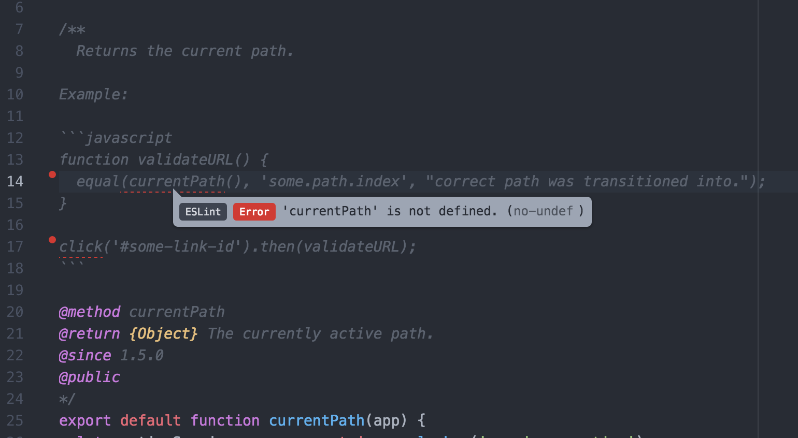

# eslint-plugin-doc-code-blocks

Lint JavaScript in block comment code blocks

[](https://travis-ci.org/knownasilya/eslint-plugin-doc-code-blocks)



## Installation

You'll first need to install [ESLint](http://eslint.org):

```
$ npm i eslint --save-dev
```

Next, install `eslint-plugin-doc-code-blocks`:

```
$ npm install eslint-plugin-doc-code-blocks --save-dev
```

**Note:** If you installed ESLint globally (using the `-g` flag) then you must also install `eslint-plugin-doc-code-blocks` globally.

## Usage

Add `doc-code-blocks` to the plugins section of your `.eslintrc.js` configuration file. You can omit the `eslint-plugin-` prefix:

```js
module.exports = {
  plugins: [
    'doc-code-blocks'
  ]
};
```

## Configuration

By default, the `doc-code-blocks` plugin uses the default ESLint rules, and the values for these could change
from one ESLint release to another. So you'd want to lock in your rules, or you might want different rules
then your code base. This is how you'd do that.

In a file like `.doc.eslintrc.js` or equivalent, set something like:

```js
module.exports = {
  extends: [
    'plugin:doc-code-blocks/recommended'
  ],
  plugins: [
    'doc-code-blocks'
  ],
  rules: {
    'quotes': ['error', 'single']
  }
};
```

You can now call this via `eslint --config .doc.eslintrc.js your_files`, basically you'd have to calls to `esslint`, one for your code
and one for the comments.

You can use all of the default ESLint rules here, like `quotes` above.

*Note: This plugin doesn't currently provide any rules of it's own.*

### Available Extends

- `'plugin:doc-code-blocks/all'` - This is essentially `eslint:all`, and can break your build from release to release, since all rules are enabled,
  even new ones. Make sure to turn off rules you don't want, if using this mode.
- `'plugin:doc-code-blocks/recommended'` - This is essentially `eslint:recommended`, and shouldn't break within a major version of ESLint.

## Attribution

Thanks to @locks for the idea, and thanks to @ilyavolodin and @platinumazure from the ESLint gitter channel.
Also took inspiration from https://github.com/eslint/eslint-plugin-markdown
